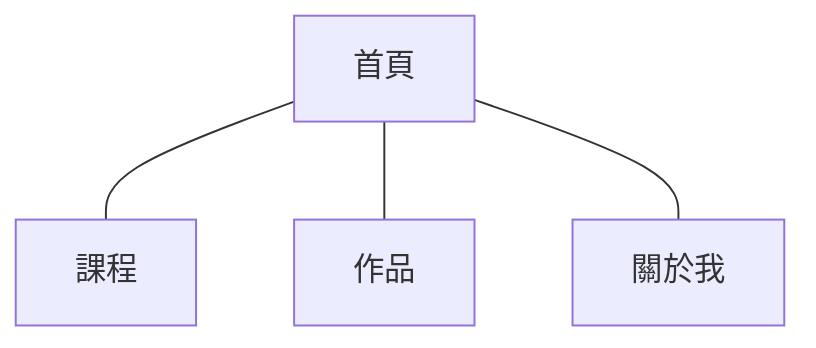

# parsonal_project_vue

parsonal project vue version
預計用 Vue 改寫個人專題，後續再嘗試使用 Nuxt 做成 SSA 以達到 SEO。
使用 json 檔當作資料庫做出 RESTful API 的效果，用更新 json 檔內容來更新網站內容。

## 開發環境

-   Vue3 + Vite
-   pinia 儲存庫 + Vue Router 切換分頁
-   CSS 預處理器 scss
-   引入 cypress 測試
-   用 pnpm 管理套件
-   用 Google firebase 託管網站

## 網頁架構

## 網站目的

協助家母經營個人工作室，並且練習實作 Vue 3 。
